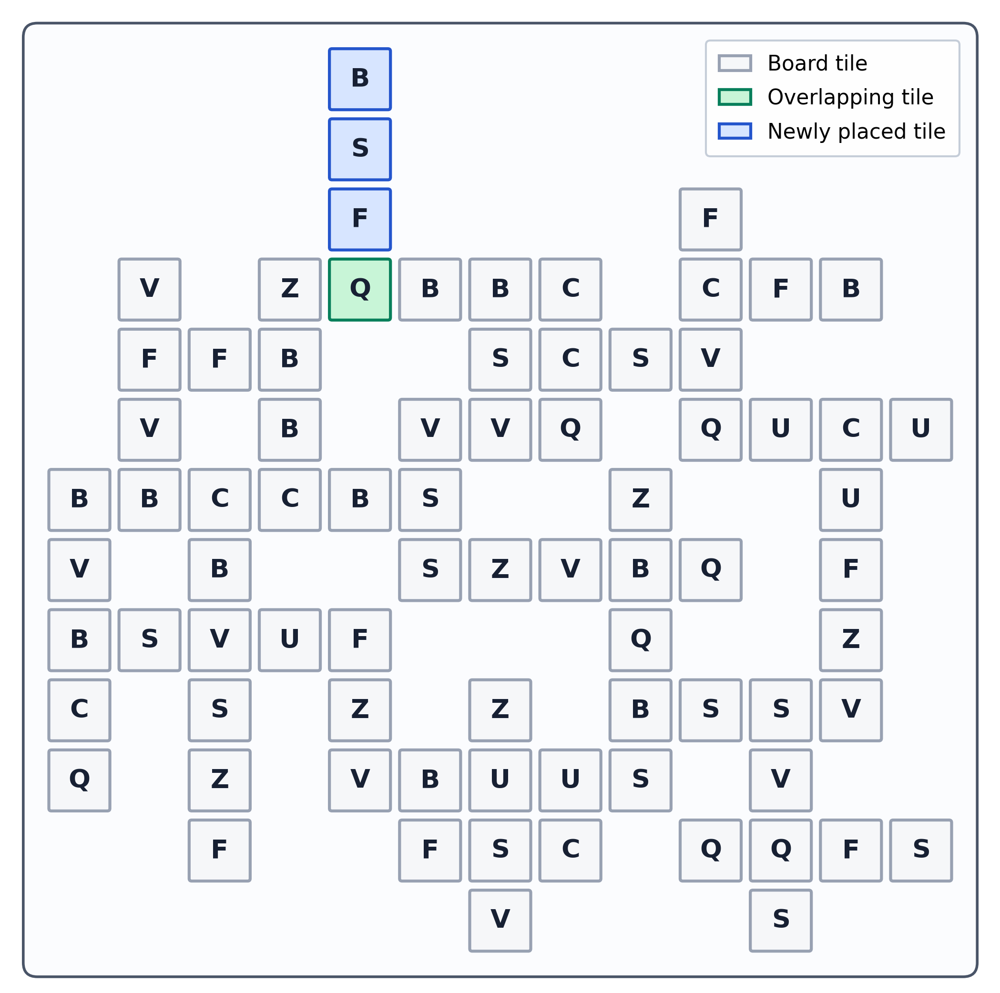
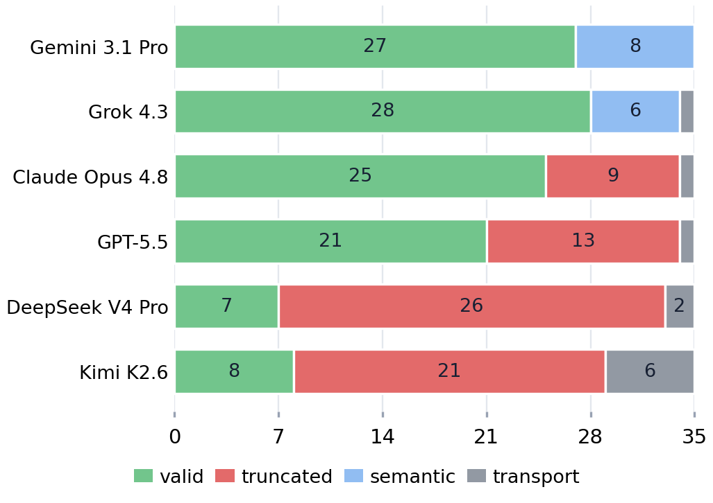

# 🧩 Frabble

**A Spatial Reasoning Benchmark Based on Formal-Language Scrabble**

*Developed by Max Huppertz and Maximilian Armuss at the Technical University of Munich.*

[Read the paper](assets/readme/frabble-paper.pdf) · [Start with the guide](docs/getting-started.md) · [Explore all docs](docs/README.md)

Frabble evaluates LLM reasoning through a game that feels like Scrabble but uses an artificial language instead of natural language. There are no English words for the model to remember. For every case, Frabble creates a new set of symbols, new language rules, and a new board.

The model receives a partially filled board, a rack of scored symbols, and the complete rules of the artificial language. Its task is to place one valid, high-scoring sequence that connects to the board. The answer is checked directly by code, so no second LLM has to decide whether it is correct.

> **New language. New board. One move. Exact checking.**

<p align="center">
  
</p>

<p align="center"><em>Here, the model places <code>BSFQ</code> vertically. The green <code>Q</code> connects the move to the existing board. The blue tiles come from the rack.</em></p>

## 🎯 How it works

1. **Frabble creates a small artificial language.** A rule can say that certain short symbol combinations are not allowed. A sequence is valid when it follows all of these rules.
2. **The generator builds a valid board.** It places one valid sequence after another. It also saves a known next move, so the resulting puzzle is guaranteed to have a solution.
3. **The known move is hidden from the model.** The model only sees the board, its rack, the symbol scores, and the language rules. It must find its own move.
4. **The submitted move is checked by code.** It must use the rack correctly, connect to the board, avoid conflicts, and keep every newly formed sequence valid.

The saved solution is called a *witness*. It proves that the puzzle can be solved, but it is not necessarily the best possible move. A model can find a different move and may even achieve a higher score.

## 💡 Why Frabble?

Many reasoning benchmarks are written in natural language and contain questions that stay the same over time. A model may have seen similar material during training. It may also use familiar wording and language patterns as shortcuts instead of solving the underlying problem.

Frabble removes that familiar language. Each case starts with new artificial rules that are fully shown to the model. The benchmark can also generate new boards at different difficulty levels instead of relying on one fixed test set. Since every rule is explicit, the final move can be checked exactly and does not need an LLM judge.

The [paper](assets/readme/frabble-paper.pdf) explains the research motivation, formal languages, and generation process in more depth.

## 📊 Results & discussion

The evaluated frontier models behaved very differently, especially when the boards became larger. No model handled the full range of cases consistently. More importantly, the models did not all fail in the same way.

<p align="center">
  
</p>

Gemini and Grok usually returned a final move, but some of those moves broke a game rule. Claude, GPT, DeepSeek, and Kimi showed the opposite pattern. Their returned moves were valid, but they often reached the maximum number of completion tokens before producing a final answer.

That difference changes how we should interpret a failure. A wrong move points to a mistake in reasoning or rule following. No move at all is less clear. The model may have been unable to find a valid move, or it may have found one and continued searching for a better score until its token budget ran out.

The valid answers add another useful signal. Models often matched or improved on the hidden witness move. This suggests that they were not only searching for any valid answer. They were also responding to the instruction to find a high-scoring move.

These results describe the complete evaluation setup. That includes the model, provider, inference settings, and token limit. The [paper](assets/readme/frabble-paper.pdf) contains the full numbers, experimental details, and limitations.

## 🧭 Before you use the code

The commands in this repository build on each other. A grammar defines the artificial language. A generation config turns that language into a board. A case-set config freezes puzzles for comparison. A run config decides which models receive those puzzles.

If this is your first time in the repository, read the [Frabble Workflow Guide](docs/getting-started.md). It explains how grammar sampling, scenario generation, frozen cases, model runs, notebooks, and output artifacts fit together.

If you only want a quick look, the checked-in configs below let you generate a small puzzle locally or run a small evaluation.

## 🚀 Quickstart

Frabble requires Python 3.11 or newer and [`uv`](https://docs.astral.sh/uv/).

```bash
git clone https://github.com/maximilian-armuss-dev/multidimensional-scrabble-benchmark.git
cd multidimensional-scrabble-benchmark
uv sync
```

### Generate a puzzle locally

```bash
uv run sample-grammar --config evaluation_base_grammar
uv run analyze-grammar evaluation_base_grammar --max-length 10
uv run generate --config evaluation_base_sanity_check
```

These commands do not call an LLM. They create a sampled grammar and a small generated scenario. Open [`visualization/inspect_scenario.ipynb`](visualization/inspect_scenario.ipynb), set `SCENARIO_PATH` to `outputs/scenarios/evaluation_base_sanity_check.json`, and run the notebook to watch the board grow.

### Run an evaluation

Create a local environment file and add the provider key required by the selected model profiles:

```bash
cp .env.example .env
uv run prepare --config 1r_sanity_check
```

`prepare` creates the cases locally and does not call an LLM. After preparation, start the model run with:

```bash
uv run evaluate --config or_1r_sanity_check
```

> **Cost warning:** `evaluate` sends real provider requests. The checked-in example targets several OpenRouter models. Inspect and narrow its [run config](config/evaluation/runs/or_1r_sanity_check.yaml) before starting.

Open [`visualization/inspect_evaluation.ipynb`](visualization/inspect_evaluation.ipynb) to explore the results. The [workflow guide](docs/getting-started.md) explains the surrounding artifact lifecycle and points to the configs and implementation that own each phase.

## 📚 Paper & documentation

- [Getting Started with Frabble](docs/getting-started.md) explains the practical workflow from grammar sampling to evaluation.
- [Frabble paper](assets/readme/frabble-paper.pdf) covers the benchmark design, experiments, results, and limitations.
- [Documentation index](docs/README.md) links to the complete conceptual and technical reference.
