# Documentation Map

Frabble generates board puzzles over sampled artificial languages, presents frozen puzzles to language models, and validates the returned moves with deterministic code. The documentation follows those stable system boundaries rather than mirroring individual source files.

## System view

```mermaid
flowchart LR
    Grammar["Sampled language"] --> Generator["Scenario generation"]
    Generator --> Scenario["Witness history"]
    Scenario --> Case["Frozen evaluation case"]
    Case --> Prompt["Model prompt"]
    Prompt --> Move["Submitted move"]
    Move --> Validation["Deterministic validation"]
    Validation --> Results["Attempts and aggregates"]
```

A grammar defines valid symbol sequences and their scores. Scenario generation grows a sparse board while retaining known-valid continuations. Evaluation freezes one board state, rack, grammar, and hidden witness before any model call. The returned move is then evaluated independently rather than compared with that witness.

For a practical path through commands and artifacts, start with the [Workflow Guide](getting-started.md).

## Foundations

These pages define concepts shared by generation and evaluation:

| Page | Boundary |
|---|---|
| [Language and Grammar](foundations/language-and-grammar.md) | Strictly Local language semantics, sampling, growth analysis, and grammar artifacts. |
| [Domain and Representations](foundations/domain-and-representations.md) | Boards, moves, scenarios, cases, prompts, and the boundaries between their representations. |
| [Move Validation](foundations/move-validation.md) | Deterministic legality, score, and strict versus format-robust evaluation. |

## Scenario generation

| Page | Boundary |
|---|---|
| [Generation Overview](generation/README.md) | How a grammar becomes a reproducible scenario with hidden witness moves. |
| [Candidate Search](generation/search.md) | Geometry, ranking, search budgets, and what exhausted search means. |
| [Local Slot Solver](generation/slot-solver.md) | How one slot's symbol domains become an accepted sequence. |

## Evaluation

| Page | Boundary |
|---|---|
| [Evaluation Overview](evaluation/README.md) | Frozen cases, preparation, model runs, package boundaries, and result layers. |
| [Configuration](evaluation/configuration.md) | Grammar, generation, case-set, run, and model-profile configuration. |
| [Artifacts and Lifecycle](evaluation/artifacts.md) | Manifests, identity, persistence, resume behavior, and aggregate outputs. |
| [Model Execution](evaluation/model-execution.md) | Concurrency, cooldowns, retries, provider calls, and terminal attempts. |

## Implementation entry points

| Area | Source of truth |
|---|---|
| Language and grammar | [`src/formal/language.py`](../src/formal/language.py), [`src/formal/grammar/`](../src/formal/grammar/) |
| Domain and validation | [`src/domain/`](../src/domain/), [`src/formal/validation.py`](../src/formal/validation.py) |
| Scenario generation | [`src/generator/`](../src/generator/), [`src/formal/slot_csp.py`](../src/formal/slot_csp.py) |
| Evaluation | [`src/evaluation/`](../src/evaluation/), [`src/llm/`](../src/llm/) |
| Active experiment choices | [`config/`](../config/) |
| Inspection notebooks | [`visualization/`](../visualization/) |

Source models and schemas define implemented behavior. Checked-in configs define active choices. These pages explain why the boundaries exist and how information moves between them without copying volatile defaults or exhaustive field lists.
