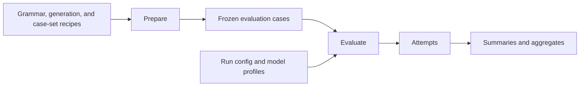

# Evaluation System

Evaluation separates puzzle construction from model execution. Cases are generated and frozen before any provider call, so model selection, concurrency, retries, or an interrupted run cannot silently change the questions being compared.

## Two phases

`prepare` expands a case-set recipe into reproducible grammars, scenarios, and cases. This phase is local and model-independent.

`evaluate` combines the frozen cases with selected model profiles, sends the jobs asynchronously, parses and validates responses, persists final attempts, and derives result views.

## Comparison boundary

An `EvaluationCase` is the stable question shared across models. It embeds the concrete grammar, reconstructed board, rack, hidden witness, resolved generation context, seeds, hashes, and provenance needed to reproduce that question without consulting mutable YAML recipes.

Board size counts the placed segments visible in the exposed state. A sampling round produces another grammar and board at that size. For positive sizes, preparation reconstructs the corresponding scenario state and uses its next transition as the hidden witness; the size-zero boundary exposes an empty board and uses the generated initial move.

The witness establishes that a solution exists but is never compared as an answer key. Prompting uses only the visible case state, and the submitted move is checked independently. The versioned case model lives in [`src/evaluation/models.py`](../../src/evaluation/models.py), with snapshot construction in [`src/evaluation/case_snapshot.py`](../../src/evaluation/case_snapshot.py).

## Package boundaries

| Responsibility | Implementation |
|---|---|
| Compose and prepare a case set | [`src/evaluation/prepare.py`](../../src/evaluation/prepare.py), [`src/evaluation/case_preparation.py`](../../src/evaluation/case_preparation.py) |
| Derive case coordinates and seeds | [`src/evaluation/case_sampling.py`](../../src/evaluation/case_sampling.py), [`src/evaluation/sampling.py`](../../src/evaluation/sampling.py) |
| Snapshot generator history into cases | [`src/evaluation/case_snapshot.py`](../../src/evaluation/case_snapshot.py) |
| Expand cases and models into jobs | [`src/evaluation/jobs.py`](../../src/evaluation/jobs.py) |
| Execute and persist one model job | [`src/evaluation/job_execution.py`](../../src/evaluation/job_execution.py) |
| Coordinate and resume a run | [`src/evaluation/runner.py`](../../src/evaluation/runner.py), [`src/evaluation/run_artifacts.py`](../../src/evaluation/run_artifacts.py) |
| Aggregate attempts | [`src/evaluation/result_aggregation.py`](../../src/evaluation/result_aggregation.py) |

Provider access remains behind [`src/llm/`](../../src/llm/), generation behind [`src/generator/`](../../src/generator/), and move legality behind [`src/formal/validation.py`](../../src/formal/validation.py). This dependency direction keeps provider execution from resampling puzzles or redefining their semantics.

## Results

Each job ends in one persisted attempt. Completed attempts contain the prompt, raw response, parsed move, strict and format-robust evaluation, timing, usage, provider metadata, and retry history. Transport failures remain distinguishable from completed but semantically invalid responses.

Attempts feed a compact summary, a detailed grouped aggregate, and long-form CSV rows. Results are grouped across stable experiment coordinates such as model, board size, language representation, reasoning effort, and sampled grammar; quality measures remain separate from pass/fail validity.

The surrounding pages each own one narrower boundary:

- [Configuration](configuration.md) connects reusable recipes, case sets, runs, and model profiles.
- [Artifacts and Lifecycle](artifacts.md) describes persistence, identity, and resume behavior.
- [Model Execution](model-execution.md) describes concurrency, cooldowns, retries, and terminal attempts.
- [Move Validation](../foundations/move-validation.md) describes the deterministic semantic checks.
