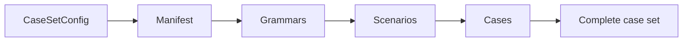

# Evaluation Artifacts and Lifecycle

Evaluation artifacts form a durable chain from reproducible puzzle recipes to provider responses and aggregate metrics. Manifests, hashes, and immediate attempt writes make preparation and execution resumable without treating partial output as complete.

## Artifact layout

```text
outputs/evaluation/<case-set>/
├── prepare-manifest.json
├── grammars/
├── scenarios/
├── cases/
├── schemas/
└── runs/<run-id>/
    ├── run-manifest.json
    ├── attempts/
    ├── summary.json
    ├── aggregate.json
    └── results.csv
```

The case-set level is model-independent. It contains the sampled language, scenario history, and portable questions that runs may reuse. A run adds one resolved run config, its model jobs, responses, evaluations, and result views.

## Preparation lifecycle



Preparation creates or loads the manifest and materializes each grammar, scenario, and case chain. An artifact is reused only when its semantic identity, config hash, and file checksum still match. Failures are recorded as they occur, and the case set becomes complete only after every requested case succeeds.

`--clean` removes a complete case-set directory, including runs that depend on those cases, before rebuilding it. Preparation orchestration lives in [`src/evaluation/prepare.py`](../../src/evaluation/prepare.py), with manifest and schema handling in [`src/evaluation/preparation_artifacts.py`](../../src/evaluation/preparation_artifacts.py).

## Run lifecycle

A run is identified by the canonical hash of its resolved run config. An incomplete matching run can resume; otherwise evaluation creates a timestamped run directory. Stable job IDs identify each case/model combination.

Every terminal job writes one attempt immediately. When no jobs remain pending, the run manifest is finalized and attempts become three views:

- `summary.json` contains compact headline metrics;
- `aggregate.json` retains detailed grouped measurements;
- `results.csv` exposes long-form rows for external analysis.

Run identity and resume lookup live in [`src/evaluation/run_artifacts.py`](../../src/evaluation/run_artifacts.py), and result transformation in [`src/evaluation/result_aggregation.py`](../../src/evaluation/result_aggregation.py).

## Identity and provenance

Case identity combines case set, board size, and sampling round. Job identity adds the model profile, reasoning effort, and language representation. Content hashes use canonical JSON over the relevant resolved config or artifact.

Cases retain source grammar and scenario hashes plus the available Git revision. Attempts retain the provider-facing request context. Together these layers distinguish the semantic experiment from a particular machine, provider call, or execution time.
