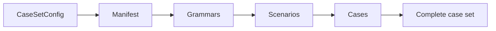

# Evaluation Artifacts and Lifecycle

Evaluation artifacts form a durable chain from reproducible puzzle recipes to provider responses and aggregate metrics. Manifests, hashes, and immediate attempt writes make preparation and execution resumable without treating partial output as complete.

## Artifact layout

```text
outputs/evaluation/<case-set>/
├── prepare-manifest.json
├── grammars/
├── scenarios/
├── cases/
├── schemas/
└── runs/<run-id>/
    ├── run-manifest.json
    ├── attempts/
    ├── attempt-history/
    ├── summary.json
    ├── aggregate.json
    └── results.csv
```

The case-set level is model-independent. It contains the sampled language, scenario history, and portable questions that runs may reuse. A run adds one resolved run config, its model jobs, responses, evaluations, and result views.

## Preparation lifecycle


```mermaid
flowchart LR
    CaseSetConfig --> Manifest
    Manifest --> Grammars
    Grammars --> Scenarios
    Scenarios --> Cases
    Cases --> Complete["Complete case set"]
```

Preparation creates or loads the manifest and materializes each grammar, scenario, and case chain. An artifact is reused only when its semantic identity, config hash, and file checksum still match. Failures are recorded as they occur, and the case set becomes complete only after every requested case succeeds.

The main process resolves configurations and IDs in sampling order, deduplicates
shared grammars, and checks reusable artifacts. Missing scenarios are assigned to
spawned workers, with at most one outstanding task per worker. Each worker owns
its generator, RNG, and local validation caches. It writes only its scenario;
the main process verifies the completed file, registers it, and creates the case
snapshot. Missing snapshots alone do not regenerate scenarios. Completion order
may differ, but it does not enter seed derivation or scenario content.

Scenario output uses the existing serializer and a unique temporary file in the
destination directory, followed by an atomic rename. A published scenario counts
as complete only after the main process records its checksum in the manifest.
After a crash between publication and registration, preparation regenerates the
unregistered scenario. Partial temporary files are ignored and never reused as
artifacts. Already registered results survive failures elsewhere in the pool.

On an ordinary worker exception, no new tasks are dispatched; running tasks are
drained and their successful results are registered before preparation reports
failure. An unexpected process exit reports the affected scenario IDs and stops
the pool. Ctrl+C terminates and reaps the owned worker processes. The manifest
remains in progress until all requested artifacts succeed. Repeating preparation,
including with a different worker count, resumes from verified registered results.
Separate simultaneous preparation commands targeting the same directory are not
supported.

`--clean` removes a complete case-set directory, including runs that depend on those cases, before rebuilding it. Preparation orchestration lives in [`src/evaluation/prepare.py`](../../src/evaluation/prepare.py), with manifest and schema handling in [`src/evaluation/preparation_artifacts.py`](../../src/evaluation/preparation_artifacts.py).

Cleanup runs before any workers start. Scenario coordination and process ownership
live in [`case_preparation.py`](../../src/evaluation/case_preparation.py) and
[`scenario_workers.py`](../../src/evaluation/scenario_workers.py).

## Run lifecycle

A run records the canonical hash of its resolved run config. By default, evaluation reuses the latest matching run, including one previously marked complete. Matching compares the experiment configuration while allowing execution policy, such as concurrency and retry limits, to change between invocations. A timestamped run directory is created when no matching run exists or when `--new` is supplied. Stable job IDs identify each case/model combination.

Each invocation schedules only jobs without a valid provider response. Transport errors and provider response errors keep the run incomplete, even after automatic retries are exhausted. A completed model response remains final even when its evaluated move fails. Once every job has a valid provider response, repeating the command makes no further provider calls and reports that a new run can be started with `uv run evaluate --config <name> --new`.

Every finished job writes its current attempt immediately. Replacing an unsuccessful attempt archives the previous JSON under `attempt-history/<job-id>/`, preserving error diagnostics across manual retries without counting them again in evaluation metrics. After the pending jobs have been attempted, the manifest records whether the run is complete and current attempts become three views:

- `summary.json` contains compact headline metrics;
- `aggregate.json` retains detailed grouped measurements;
- `results.csv` exposes long-form rows for external analysis.

Run identity and resume lookup live in [`src/evaluation/run_artifacts.py`](../../src/evaluation/run_artifacts.py), and result transformation in [`src/evaluation/result_aggregation.py`](../../src/evaluation/result_aggregation.py).

## Identity and provenance

Case identity combines case set, board size, and sampling round. Case sets with an explicit dimension list also include the dimension in case IDs, while older single-dimension IDs keep their original form. Job identity adds the model profile, reasoning effort, and language representation. Content hashes use canonical JSON over the relevant resolved config or artifact.

Cases retain source grammar and scenario hashes plus the available Git revision. Attempts retain the provider-facing request context. Together these layers distinguish the semantic experiment from a particular machine, provider call, or execution time.
