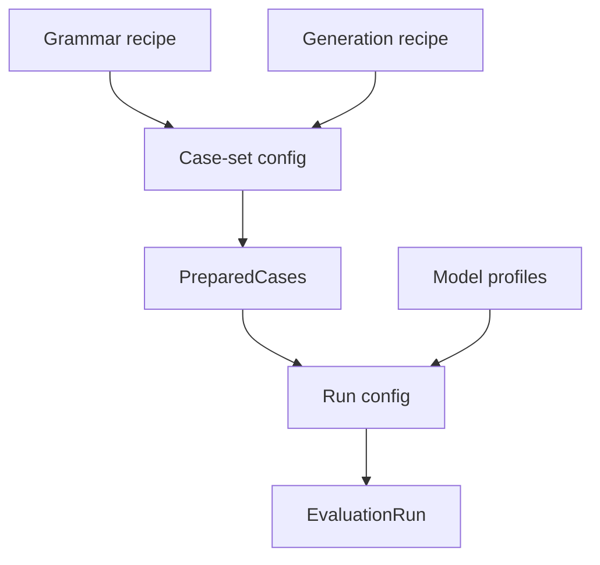

# Evaluation Configuration

Configuration separates reusable puzzle recipes from experimental sampling and provider execution. YAML records the chosen experiment, while validated models resolve the concrete configuration consumed by code.

## Configuration layers

Grammar configs describe how one artificial language is sampled. Generation configs describe how a scenario grows from a concrete grammar. Their behavior is documented in [Language and Grammar](../foundations/language-and-grammar.md) and [Scenario Generation](../generation/README.md).

A case-set config references one grammar recipe and one generation recipe, then defines the sampling matrix through its root seed, board sizes, and rounds. Preparation resolves those recipes into concrete per-case artifacts.

A run config references a completed case set. It selects model profiles and prepared board sizes and adds execution policy such as global concurrency, optional per-model concurrency, and retry limits. It never redefines the frozen cases.

Model profiles contain provider-facing identity, credentials, request limits, and backend routing. Their active values live in [`config/model_configs.yaml`](../../config/model_configs.yaml).

## Named YAML boundary

Configs are selected by filename stem. The shared loader inserts that stem as `config_name`, while domain-specific models reject unknown fields. This makes the checked-in YAML the readable experiment definition without duplicating validation rules in documentation.

| Family | Recipes | Model |
|---|---|---|
| Grammar | [`config/grammars/`](../../config/grammars/) | [`src/formal/grammar/config.py`](../../src/formal/grammar/config.py) |
| Generation | [`config/generation/`](../../config/generation/) | [`src/generator/config.py`](../../src/generator/config.py) |
| Case set | [`config/evaluation/case_sets/`](../../config/evaluation/case_sets/) | [`src/evaluation/config.py`](../../src/evaluation/config.py) |
| Run | [`config/evaluation/runs/`](../../config/evaluation/runs/) | [`src/evaluation/config.py`](../../src/evaluation/config.py) |
| Model profile | [`config/model_configs.yaml`](../../config/model_configs.yaml) | [`src/llm/env.py`](../../src/llm/env.py) |

The common filename and loading convention lives in [`src/configuration.py`](../../src/configuration.py).

## Reproducibility boundary

The case-set root seed, board size, and sampling round derive the grammar and board seeds. Resolved configs, actual grammar seeds, and source provenance are embedded into prepared artifacts and cases.

Runtime model policy remains outside the case. Jobs record the chosen language representation, reasoning effort, and model profile, while provider-specific request translation happens inside [`src/llm/client.py`](../../src/llm/client.py) and [`src/llm/openrouter_client.py`](../../src/llm/openrouter_client.py). The same frozen case can therefore be reused across models without losing the exact context of any attempt.
