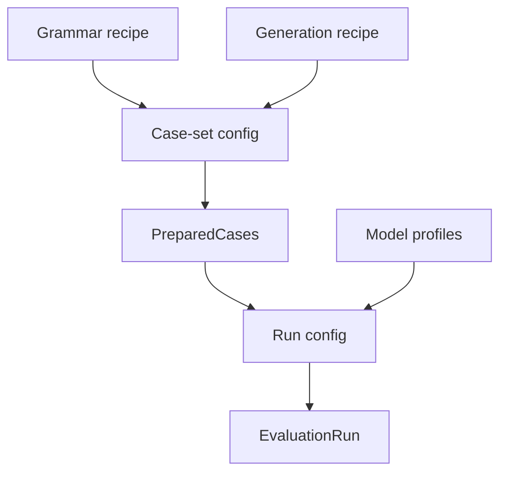

# Evaluation Configuration

Configuration separates reusable puzzle recipes from experimental sampling and provider execution. YAML records the chosen experiment, while validated models resolve the concrete configuration consumed by code.

## Configuration layers


```mermaid
flowchart TD
    GrammarConfig["Grammar recipe"] --> CaseSet
    GenerationConfig["Generation recipe"] --> CaseSet
    CaseSet["Case-set config"] --> PreparedCases
    PreparedCases --> RunConfig["Run config"]
    ModelProfiles["Model profiles"] --> RunConfig
    RunConfig --> EvaluationRun
```

Grammar configs describe how one artificial language is sampled. Generation configs describe how a scenario grows from a concrete grammar. Their behavior is documented in [Language and Grammar](../foundations/language-and-grammar.md) and [Scenario Generation](../generation/README.md).

A case-set config references one grammar recipe and one generation recipe, then defines the sampling matrix through its root seed, board sizes, rounds, and optionally a list of dimensions. Without that list, the generation recipe supplies one fixed dimension. Preparation resolves those recipes into concrete per-case artifacts.

The checked-in [pilot](../../config/evaluation/case_sets/pilot.yaml) shows the explicit dimension axis. Its cases can be prepared locally without model calls.

A run config references a completed case set. It selects model profiles and prepared board sizes and adds execution policy such as global concurrency, optional per-model concurrency, and retry limits. It never redefines the frozen cases.

Model profiles contain provider-facing identity, credentials, request limits, and backend routing. Their active values live in [`config/model_configs.yaml`](../../config/model_configs.yaml).

## Named YAML boundary

Configs are selected by filename stem. The shared loader inserts that stem as `config_name`, while domain-specific models reject unknown fields. This makes the checked-in YAML the readable experiment definition without duplicating validation rules in documentation.

| Family | Recipes | Model |
|---|---|---|
| Grammar | [`config/grammars/`](../../config/grammars/) | [`src/formal/grammar/config.py`](../../src/formal/grammar/config.py) |
| Generation | [`config/generation/`](../../config/generation/) | [`src/generator/config.py`](../../src/generator/config.py) |
| Case set | [`config/evaluation/case_sets/`](../../config/evaluation/case_sets/) | [`src/evaluation/config.py`](../../src/evaluation/config.py) |
| Run | [`config/evaluation/runs/`](../../config/evaluation/runs/) | [`src/evaluation/config.py`](../../src/evaluation/config.py) |
| Model profile | [`config/model_configs.yaml`](../../config/model_configs.yaml) | [`src/llm/env.py`](../../src/llm/env.py) |

The common filename and loading convention lives in [`src/configuration.py`](../../src/configuration.py).

## Preparation execution

Preparation distributes independent scenarios across local processes. Each scenario
still grows sequentially, with one CP-SAT search thread; its seed and generated
content are independent of the worker count. Shared grammars are prepared once in
the main process before missing scenarios are dispatched.

```bash
uv run prepare --config final               # automatic CPU-based worker cap
uv run prepare --config final --workers 1   # serial, in the calling process
uv run prepare --config final --workers 4   # at most four scenario workers
```

The Python entry point accepts the same execution option as
`prepare_case_set(config, workers=...)`. `None` selects at most four workers,
bounded by available CPUs and missing scenarios, with a CPU fallback of one.
Positive integers set an explicit cap; zero and negative values are rejected
before any cleanup or output writes. One effective worker runs in-process, and a
fully reusable case set starts no workers. The cap does not detect available RAM.

Worker count is absent from experiment hashes and YAML recipes. Changing it can
reuse the same registered artifacts. Parallel execution uses `spawn`; Python
scripts that call preparation need the usual `if __name__ == "__main__":` entry
guard. Interactive environments that cannot import their main module can use
`workers=1` or the CLI.

The main process owns the progress displays. Workers report cumulative move counts
in batches, with a final exact count on completion or error. Non-TTY execution
disables terminal bars while retaining the same preparation behavior. Artifact
recovery is described in [Artifacts and Lifecycle](artifacts.md); measurement
commands and the scope of performance validation are in [Preparation Performance](performance.md).

## Reproducibility boundary

The case-set root seed, board size, and sampling round derive the grammar and board seeds. A dimensional comparison reuses the same sampled grammar and board seed at each size and round, while the generator runs separately in every requested dimension. Resolved configs, actual grammar seeds, and source provenance are embedded into prepared artifacts and cases.

Slot enumeration reuses pure validation results only within one board/language
call. No cache survives into the next board or scenario, and model, slot, and
symbol ordering remain unchanged. Exact selected moves are checked against
pre-change serial fixtures under the same Python and OR-Tools versions. Wall-clock
optimality limits still apply: CPU contention can cause a certification failure,
which aborts that scenario instead of saving a heuristic move. Reducing workers
can help with contention; preparation does not silently raise time limits.

Runtime model policy remains outside the case. Jobs record the chosen language representation, reasoning effort, and model profile, while provider-specific request translation happens inside [`src/llm/client.py`](../../src/llm/client.py) and [`src/llm/openrouter_client.py`](../../src/llm/openrouter_client.py). The same frozen case can therefore be reused across models without losing the exact context of any attempt.
