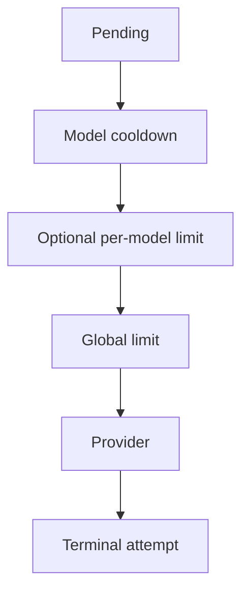

# Model Execution

An evaluation run contains independent case/model jobs. They execute concurrently to use provider capacity efficiently, while explicit limits, visible retries, and terminal attempt artifacts keep that concurrency reproducible and resumable.

## Concurrency model

The global limit bounds all active provider calls. An optional per-model semaphore adds a smaller window for profiles with different upstream capacity. Cooldown and retry waits occur outside the global provider semaphore so delayed jobs do not consume active-call slots.

LiteLLM-backed and OpenRouter-backed calls meet at the same call-result boundary in [`src/llm/result.py`](../../src/llm/result.py). The provider clients remain behind [`src/llm/client.py`](../../src/llm/client.py) and [`src/llm/openrouter_client.py`](../../src/llm/openrouter_client.py).

## Retries and cooldowns

Only temporary transport failures are retried within the run config's budget. Retry timing prefers provider guidance such as reset headers and otherwise uses bounded exponential delay with jitter. A rate-limit response may extend a cooldown for one model profile while other models continue.

Provider SDK retries are disabled where requests are created. Keeping retry policy in the evaluation layer makes request count, wait time, failed calls, and terminal status visible in benchmark artifacts.

A successful provider response is terminal even when its move is invalid. Retrying a semantic failure would turn one evaluation job into repeated sampling and change the experiment.

## Persistence and ordering

One final attempt summarizes the complete retry sequence for a job. A transport-error attempt records its failure details and retry exhaustion. If execution stops before a terminal attempt is written, that job remains pending and may be sent again when the run resumes.

Pending jobs are shuffled using a seed derived from the run config. This distributes models and board sizes across execution time while keeping the order reproducible for the same run identity.

[`src/evaluation/runner.py`](../../src/evaluation/runner.py) coordinates the job set. [`src/evaluation/job_execution.py`](../../src/evaluation/job_execution.py) owns semaphore use, cooldowns, retries, provider calls, parsing, and attempt construction. [`src/evaluation/run_artifacts.py`](../../src/evaluation/run_artifacts.py) decides which stored attempts are terminal.
