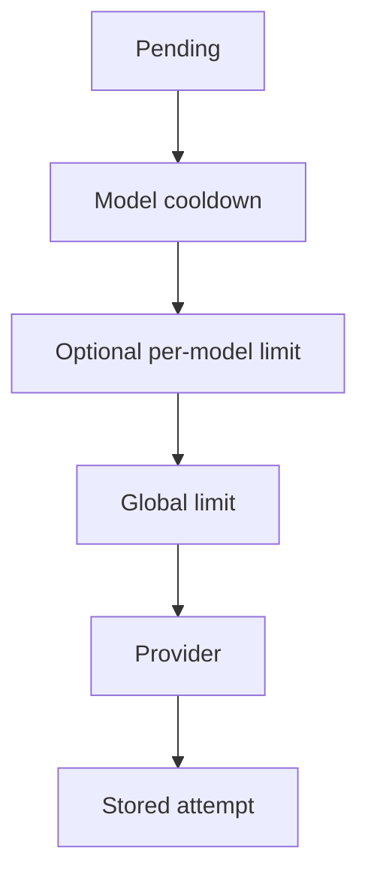

# Model Execution

An evaluation run contains independent case/model jobs. They execute concurrently to use provider capacity efficiently, while explicit limits, visible retries, and terminal attempt artifacts keep that concurrency reproducible and resumable.

## Concurrency model

```mermaid
flowchart TD
    Pending --> Cooldown["Model cooldown"]
    Cooldown --> ModelLimit["Optional per-model limit"]
    ModelLimit --> GlobalLimit["Global limit"]
    GlobalLimit --> Provider
    Provider --> Attempt["Stored attempt"]
```

The global limit bounds all active provider calls. An optional per-model semaphore adds a smaller window for profiles with different upstream capacity. Cooldown and retry waits occur outside the global provider semaphore so delayed jobs do not consume active-call slots.

LiteLLM-backed and OpenRouter-backed calls meet at the same call-result boundary in [`src/llm/result.py`](../../src/llm/result.py). The provider clients remain behind [`src/llm/client.py`](../../src/llm/client.py) and [`src/llm/openrouter_client.py`](../../src/llm/openrouter_client.py).

## Retries and cooldowns

Automatic retries are controlled separately from resuming a run. With `max_retries: 0`, each pending job makes one provider call per command invocation. Repeating `uv run evaluate --config <name>` retries missing results, transport exceptions, and provider response errors in the latest matching run, regardless of whether an exception qualifies for an automatic retry.

When a run config explicitly enables automatic retries, only temporary transport failures are retried within that budget. Retry timing prefers provider guidance such as reset headers and otherwise uses bounded exponential delay with jitter. A rate-limit response may extend a cooldown for one model profile while other models continue.

Provider SDK retries are disabled where requests are created. Keeping retry policy in the evaluation layer makes request count, wait time, failed calls, and terminal status visible in benchmark artifacts.

A successful provider response is terminal even when its move is invalid, malformed, or truncated by the token budget. Retrying those model outcomes would turn one evaluation job into repeated sampling and change the experiment. A response with `finish_reason=error` is instead a provider failure: its content, usage, and metadata are stored, and the job remains pending for the next invocation. Resume also recognizes this marker in older artifacts that recorded it as a completed parse failure.

## Persistence and ordering

One current attempt summarizes each job's most recent invocation, including any automatic retries. A transport-error attempt records its failure details and retry exhaustion. Before a later invocation replaces an unsuccessful attempt, the previous artifact is preserved under `attempt-history/`; aggregates use only current attempts. If execution stops before a terminal attempt is written, that job remains pending and may be sent again when the run resumes.

Pending jobs are shuffled using a seed derived from the run config. This distributes models and board sizes across execution time while keeping the order reproducible for the same run identity.

[`src/evaluation/runner.py`](../../src/evaluation/runner.py) coordinates the job set. [`src/evaluation/job_execution.py`](../../src/evaluation/job_execution.py) owns semaphore use, cooldowns, retries, provider calls, parsing, and attempt construction. [`src/evaluation/run_artifacts.py`](../../src/evaluation/run_artifacts.py) decides which stored attempts are terminal.
