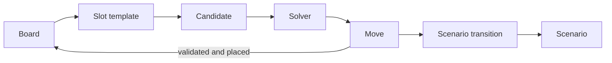

# Domain and Representation Boundaries

Frabble separates the puzzle's domain state from the forms used to search, persist, prompt, and parse it. These representations describe related information, but they are not interchangeable: each boundary retains only what its consumer needs.

## Domain model



The central concepts are:

| Concept | Role | Source of truth |
|---|---|---|
| Board | Sparse, unbounded N-dimensional state containing occupied cells and placed segments. | [`src/domain/board.py`](../../src/domain/board.py) |
| Segment | Placement history for one sequence already on the board. | [`src/domain/models.py`](../../src/domain/models.py) |
| Move | One complete proposed sequence, including consistent overlaps. | [`src/domain/models.py`](../../src/domain/models.py) |
| Slot template | A possible straight placement before free symbols are solved. | [`src/domain/models.py`](../../src/domain/models.py) |
| Scenario transition | A known-valid move coupled with its rack and newly placed cells. | [`src/domain/models.py`](../../src/domain/models.py) |
| Scenario run | An initial board followed by an ordered witness history. | [`src/domain/models.py`](../../src/domain/models.py) |

Coordinates are zero-based integer vectors whose length equals the board dimensionality. An axis selects the coordinate component that advances along a sequence. Coordinates may be negative because the board has no finite outer boundary.

Cells describe current visible state, while segments preserve how that state was created. This distinction matters for rules such as word extension. Placing a move returns a new board, allowing earlier scenario states to remain reproducible.

## Representation layers

| Layer | Purpose | Implementation |
|---|---|---|
| Domain | Geometry, placement history, and immutable board updates. | [`src/domain/`](../../src/domain/) |
| Scenario artifact | Reproducible storage of the initial board and witness transitions. | [`src/generator/scenario_codec.py`](../../src/generator/scenario_codec.py) |
| Evaluation case | Portable snapshot of one exact model question and its provenance. | [`src/evaluation/models.py`](../../src/evaluation/models.py), [`src/evaluation/case_snapshot.py`](../../src/evaluation/case_snapshot.py) |
| Prompt | Model-readable language, occupied coordinates, rack, and scores. | [`src/llm/representers.py`](../../src/llm/representers.py), [`src/llm/prompting.py`](../../src/llm/prompting.py) |
| Response | Minimal structured proposal for one move. | [`src/formal/parsing.py`](../../src/formal/parsing.py) |

Persisted scenario boards retain cells and placement history. Prompt boards use a more explanatory coordinate/symbol list. Evaluation cases embed the persisted form and reconstruct the domain board before prompting or validation.

## Move boundary

Across these layers, a move is conceptually:

```json
{
  "start": [2, 3],
  "axis": 0,
  "sequence": ["A", "B", "C", "D"]
}
```

The sequence describes the complete run across the board. Existing symbols remain in it so geometry and language membership are unambiguous, but only symbols placed into empty cells consume the rack.

## From scenario to evaluation case

A scenario stores one initial board plus witness transitions, so later states can be reconstructed by replay instead of persisted as repeated snapshots. Evaluation exposes one reconstructed state together with the next transition's rack, while hiding that transition's move from the model.

The frozen case also carries the concrete grammar, resolved generation context, seeds, hashes, and provenance. It is the boundary after which model execution can no longer change the puzzle being compared. Scenario replay lives in [`src/generator/reconstruction.py`](../../src/generator/reconstruction.py); case construction lives in [`src/evaluation/case_snapshot.py`](../../src/evaluation/case_snapshot.py).
