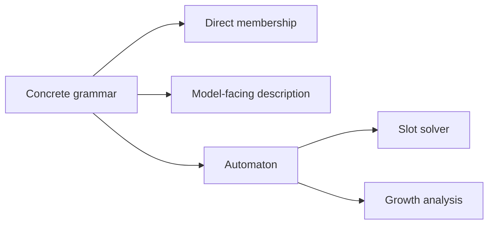
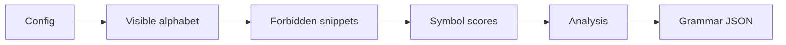

# Language and Grammar

Frabble replaces natural-language words with sequences from a freshly sampled artificial language. The same concrete grammar drives generation, appears in the model prompt, and decides whether submitted sequences are valid, so language membership never depends on vocabulary knowledge or an LLM judge.

## Strictly Local languages

A Strictly Local language consists of an alphabet, a locality width `k`, a minimum accepted length, and forbidden local snippets. A sequence is accepted when it uses only alphabet symbols, is long enough, and contains none of the forbidden snippets.

This rule has several equivalent working views:

Direct membership is used by deterministic validation. The generator's slot solver and the analysis tools use an automaton representation of the same rule. Prompt representers can describe the rule as forbidden snippets or production rules without changing its semantics.

The shared language object lives in [`src/formal/language.py`](../../src/formal/language.py), while model-facing descriptions live in [`src/llm/representers.py`](../../src/llm/representers.py).

## From recipe to concrete grammar

A grammar config describes a sampling recipe rather than one fixed language. It selects the visible alphabet family and size, locality width, minimum word length, forbidden-pattern density, seed, and acceptable growth region.

Alphabet construction is separate from rule sampling. The current implementations produce letter or Chinese-symbol alphabets; the local rule then operates over the sampled symbol identities. Symbol scores belong to the grammar but affect move quality rather than membership.

Sampling is implemented in [`src/formal/grammar/sampler.py`](../../src/formal/grammar/sampler.py), alphabet families in [`src/formal/grammar/alphabet.py`](../../src/formal/grammar/alphabet.py), and the validated recipe in [`src/formal/grammar/config.py`](../../src/formal/grammar/config.py).

## Growth and resampling

Random rule sets can be too restrictive for practical board generation or so permissive that they provide little constraint. Grammar analysis therefore computes the Perron growth rate and exact accepted-word counts across configured lengths. Auto-resampling can reject candidates outside the requested region and retry with a deterministically related seed.

Requested and actual seeds are persisted together, so a resampled language remains reproducible. Growth and word-count calculations live in [`src/formal/grammar/analysis.py`](../../src/formal/grammar/analysis.py).

## Artifacts and consumers

[`src/formal/grammar/serialization.py`](../../src/formal/grammar/serialization.py) stores a concrete grammar with its sampling context. Standalone generation loads such an artifact directly. Evaluation preparation instead derives a fresh grammar for each board-size and sampling-round coordinate and embeds the resulting concrete grammar into the frozen case.

The commands `sample-grammar` and `analyze-grammar` materialize and inspect standalone artifacts. Their entry points are declared in [`pyproject.toml`](../../pyproject.toml), and current recipes live in [`config/grammars/`](../../config/grammars/).
