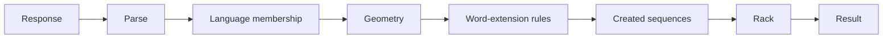

# Move Validation

Validation turns a parsed response into a deterministic benchmark result. New cases carry a hidden certified optimum for score comparison, while every submitted move is still checked independently against the board, rack, and concrete language.

## Validation flow

Parsing establishes the response shape: start coordinate, axis, and symbol sequence. Semantic validation then applies related constraints in an order that preserves useful diagnostics without treating a partial check as overall validity.

The submitted sequence must belong to the case language. Its coordinates must match the board dimensionality, existing cells may only be reused with the same symbol, and the move must introduce at least one new symbol. A move on a non-empty board must connect through a consistent overlap; the empty board used for board-size-zero cases is the deliberate exception.

A move may cross existing sequences but may not extend an already placed word. Validation simulates the placement and checks every relevant sequence created or changed by it against the same language.

Only newly placed symbols consume the rack, with multiplicity. Scoring starts with the symbol values across the complete submitted sequence, including overlaps. A newly placed symbol can get a letter multiplier when the sum of its coordinates is `2 + 10k` for an integer `k`. The multiplier varies *within* that diagonal line (2D) or hyperplane (higher dimensions): phase `P = Σ(i − 1) × coordinate[i]`, taken modulo four, selects `x4, x2, x3, x2`. On a 2D bonus diagonal this cycle repeats with every step in the first coordinate. Other cells and reused symbols score `x1`. Every axis encounters one bonus plane per ten coordinates, independent of dimension or board size. Bonuses on different new symbols add to the move score; they do not multiply each other. The line at coordinate sum `2` is close to the initial board, although a legal bonus move is not guaranteed for every rack and board. Score measures quality and never changes whether the move is legal.

## Result views

[`src/formal/validation.py`](../../src/formal/validation.py) owns semantic legality. [`src/benchmark/scoring.py`](../../src/benchmark/scoring.py) owns the coordinate multiplier and move score. [`src/llm/evaluation.py`](../../src/llm/evaluation.py) expands legality and score into the granular fields stored in an attempt, including parse, language, geometry, overlap, rack use, move length, and primary failure type. The model receives the same scoring rule in [`prompts/system.txt`](../../prompts/system.txt).

Strict parsing supplies the headline benchmark result. A separate format-robust diagnostic can recover common sequence-serialization mistakes without replacing the strict outcome. Parsing lives in [`src/formal/parsing.py`](../../src/formal/parsing.py), and [`src/evaluation/job_execution.py`](../../src/evaluation/job_execution.py) orchestrates both views.
