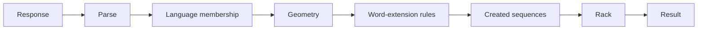

# Move Validation

Validation turns a parsed response into a deterministic benchmark result. The hidden witness proves that a case is solvable but is not an answer key: every submitted move is checked independently against the board, rack, and concrete language.

## Validation flow

Parsing establishes the response shape: start coordinate, axis, and symbol sequence. Semantic validation then applies related constraints in an order that preserves useful diagnostics without treating a partial check as overall validity.

The submitted sequence must belong to the case language. Its coordinates must match the board dimensionality, existing cells may only be reused with the same symbol, and the move must introduce at least one new symbol. A move on a non-empty board must connect through a consistent overlap; the empty board used for board-size-zero cases is the deliberate exception.

A move may cross existing sequences but may not extend an already placed word. Validation simulates the placement and checks every relevant sequence created or changed by it against the same language.

Only newly placed symbols consume the rack, with multiplicity. A valid move receives the sum of the configured symbol values across its complete sequence, including overlaps. Score measures quality and never changes whether the move is legal.

## Result views

[`src/formal/validation.py`](../../src/formal/validation.py) owns semantic legality. [`src/llm/evaluation.py`](../../src/llm/evaluation.py) expands that result into the granular fields stored in an attempt, including parse, language, geometry, overlap, rack use, move length, score, and primary failure type.

Strict parsing supplies the headline benchmark result. A separate format-robust diagnostic can recover common sequence-serialization mistakes without replacing the strict outcome. Parsing lives in [`src/formal/parsing.py`](../../src/formal/parsing.py), and [`src/evaluation/job_execution.py`](../../src/evaluation/job_execution.py) orchestrates both views.
