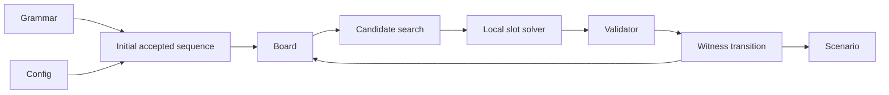

# Scenario Generation

The generator creates reproducible puzzle histories with a known legal continuation at every exposed state. It does not solve arbitrary boards exhaustively; it constructs one valid witness move at a time and retains the path needed to rebuild earlier states.

## Generation flow

The concrete grammar supplies accepted sequences and symbol values. The generation config supplies dimensionality, word lengths, search bounds, ranking preferences, rack noise, and a seed. An initial accepted sequence creates the first sparse board state.

For each later transition, occupied cells offer crossing anchors. Concrete slot templates fix their geometry and any symbols already present. Cross-word context narrows the remaining symbol domains, the local solver fills one template with an accepted sequence, and the shared validator checks the complete move before it is stored.

Three authorities remain separate throughout this flow:

- geometry determines where a sequence could fit;
- language solving determines whether one template can contain an accepted sequence;
- validation determines whether the resulting move satisfies every benchmark rule.

Ranking only changes search order. A solver result is still a candidate, and neither heuristic score nor local satisfiability can override final validation.

## Witness history

A successful scenario contains an initial board and an ordered series of transitions. Each transition records the rack, complete witness move, newly placed cells, and optionally a search trace. Later boards are reconstructed by replaying this history.

For evaluation, one reconstructed board and the next transition's rack become the visible puzzle. The next move is hidden as a solvability witness. A model may return that move or any different move that passes independent validation.

Random choices derive from the generator seed, while candidate ties use stable ordering. Given the same concrete grammar, resolved config, and seed, generation is intended to produce the same scenario.

## Component map

- [Candidate Search](search.md) explains ranking, batching, budgets, and the meaning of failure.
- [Local Slot Solver](slot-solver.md) explains how per-position domains become one accepted sequence.
- [Domain and Representation Boundaries](../foundations/domain-and-representations.md) describes boards, moves, transitions, and persisted forms.
- [Move Validation](../foundations/move-validation.md) describes the semantic boundary shared with model submissions.

The orchestration lives in [`src/generator/engine.py`](../../src/generator/engine.py), candidate construction in [`src/generator/candidates.py`](../../src/generator/candidates.py), scenario encoding in [`src/generator/scenario_codec.py`](../../src/generator/scenario_codec.py), and active recipes in [`config/generation/`](../../config/generation/).
