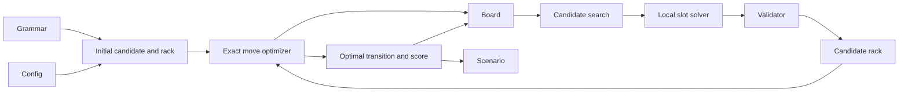

# Scenario Generation

The generator creates reproducible puzzle histories with a certified best move for every exposed board and rack. A local search first finds a valid candidate to define the rack. An exact optimizer then considers every legal placement for that rack, and its chosen move becomes the next board state.

## Generation flow

The concrete grammar supplies accepted sequences and symbol values. The generation config supplies dimensionality, candidate lengths, search bounds, ranking preferences, rack noise, an optimality deadline, and a seed. An initial accepted sequence supplies the first rack; the optimizer chooses the initial placement on the empty board.

For each later transition, occupied cells offer crossing anchors. Concrete slot templates fix their geometry and any symbols already present. Cross-word context narrows the remaining symbol domains, the local solver fills one template with an accepted sequence, and the shared validator checks it. Its new symbols, plus configured rack noise, define the rack. The optimizer searches all legal moves for that rack, certifies the maximum score, and places its chosen move. A run fails rather than saving an unproven optimum if the deadline is exhausted.

Four roles remain separate throughout this flow:

- geometry determines where a sequence could fit;
- language solving determines whether one template can contain an accepted sequence;
- validation determines whether the resulting move satisfies every benchmark rule.
- optimization determines the highest score for the board and rack.

Ranking only changes which candidate supplies the rack. The candidate's length, including the configured final candidate length, need not equal the optimal move's length. Every optimized move is checked again by the shared validator.

## Optimal move history

A successful version-2 scenario contains an initial board and an ordered series of transitions. Each transition records the rack, complete optimal move, certified score, newly placed cells, and optionally the candidate search trace. Later boards are reconstructed by replaying the optimal moves. The initial rack and optimal score are stored with the scenario so an empty-board evaluation case can be frozen directly from it.

For evaluation, one reconstructed board and the next transition's rack become the visible puzzle. The optimal move and score remain hidden from the model. A model may return that move or any different move that passes independent validation. Historical version-1 scenarios have valid reference moves without optimality certificates and remain readable as such.

Random choices derive from the generator seed, while candidate ties use stable ordering. Given the same concrete grammar, resolved config, and seed, generation is intended to produce the same scenario.

## Component map

- [Candidate Search](search.md) explains ranking, batching, budgets, and the meaning of failure.
- [Local Slot Solver](slot-solver.md) explains how per-position domains become one accepted sequence.
- [Exact Move Optimizer](../../src/benchmark/optimality.py) implements finite slot enumeration, rack and language constraints, scoring, and optimality bounds.
- [Domain and Representation Boundaries](../foundations/domain-and-representations.md) describes boards, moves, transitions, and persisted forms.
- [Move Validation](../foundations/move-validation.md) describes the semantic boundary shared with model submissions.

The orchestration lives in [`src/generator/engine.py`](../../src/generator/engine.py), candidate construction in [`src/generator/candidates.py`](../../src/generator/candidates.py), scenario encoding in [`src/generator/scenario_codec.py`](../../src/generator/scenario_codec.py), and active recipes in [`config/generation/`](../../config/generation/).
