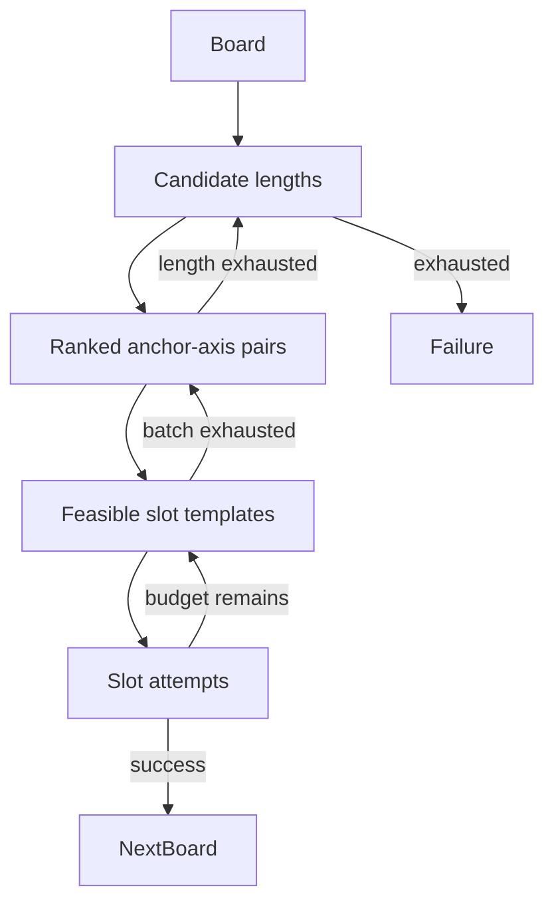

# Candidate Search

One board can offer many geometrically plausible placements. Candidate search orders and bounds this work so scenario generation remains reproducible and operationally finite without confusing explored possibilities with the full legal move space.

## Search shape

For an unchanged board, each configured word length is considered at most once. Occupied coordinates paired with unused crossing axes form anchors. Anchors are expanded in batches into concrete slots, allowing the generator to widen from preferred candidates toward more distant parts of the board without reconsidering previous work.

Templates are removed before solving when their geometry conflicts with the board, they repeat a known slot, they would deterministically extend an existing word, or cross-word analysis leaves an empty symbol domain. The surviving templates share a cumulative solver-attempt budget for the current length.

## Ranking

Anchor ranking combines distance from the current board centroid with the recency of the most recent sequence crossing that cell. Once a complete template exists, ranking also considers the mean distance of its new cells and their local occupied density. Local density counts contacts between new cells and the existing board, excluding contacts within the proposed word. A penalty for extra contacts favors branches over placements that fill crowded gaps. Features are normalized within the current candidate pool before configured weights are applied.

The generator can shuffle templates within small consecutive ranking windows. This breaks coordinate-order ties and introduces local variety while keeping the seed reproducible. A window of one preserves strict ranking. The evaluation-base recipe combines a recency preference, a local density penalty, and a window of eight. This favors branching growth while reducing filled-in blocks without checking for particular board shapes.

These scores express a preference for where growth should happen. They do not predict legality: a highly ranked template may have no language solution, while a later candidate may validate successfully.

Feature calculation and stable ordering live in [`src/generator/candidates.py`](../../src/generator/candidates.py), with geometric measurements in [`src/benchmark/scoring.py`](../../src/benchmark/scoring.py). Weights and search bounds belong to [`src/generator/config.py`](../../src/generator/config.py) and the checked-in generation recipes.

## Failure semantics

Terminal errors distinguish broad exhaustion points such as missing anchors, no feasible templates, no local solver solution, or validator rejection. These categories describe the path actually searched and help identify restrictive configs or broken invariants.

An exhausted search is not a proof that the board has no legal move. It only means that the configured lengths, anchor range, template budget, and solver attempts did not produce another witness. A scenario is considered successful only after reaching its requested witness count; incomplete growth is not persisted as a completed result.

The search loop and failure accounting live in [`src/generator/engine.py`](../../src/generator/engine.py). The distinction between a local solver result and full move validity is explained in [Local Slot Solver](slot-solver.md).
