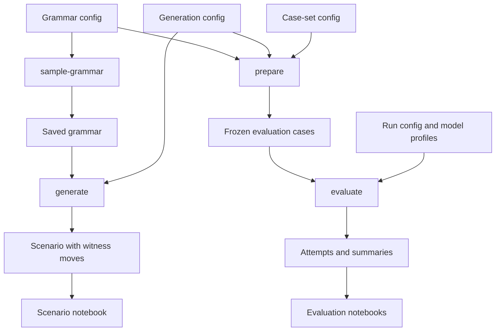

# Getting Started with Frabble

This guide sits between the project README and the technical reference. It explains how the main pieces fit together, which command to run at each stage, and where to look at the result. You do not need to understand the constraint solver or the evaluation internals before starting.

## Choose your path

- If you want to see a generated puzzle, follow [Generate and visualize a scenario](#generate-and-visualize-a-scenario). This path runs locally and needs no API key.
- If you want to send one puzzle to one model, follow [Try one model interactively](#try-one-model-interactively).
- If you want to compare models on frozen cases, follow [Prepare and run an evaluation](#prepare-and-run-an-evaluation).

## The mental model

Frabble has two related workflows. The first creates one standalone scenario for exploration. The second prepares a set of independent cases and evaluates models on those exact same cases.



The four objects to keep in mind are:

| Object | Intuition |
|---|---|
| Grammar | The rules that decide which artificial symbol sequences count as valid words. |
| Scenario | One board history. It contains an initial board and a chain of known valid next moves. |
| Evaluation case | One frozen question for a model. It contains the visible board, rack, rules, hidden witness, and provenance. |
| Evaluation run | A mapping from prepared cases to model profiles, plus execution settings. |

The most common source of confusion is the difference between `generate` and `prepare`. `generate` creates one standalone scenario from one saved grammar. `prepare` creates every case needed for an evaluation. It samples a fresh grammar and generates a fresh scenario for each board-size and sampling-round combination, then freezes the result before any model is called.

## Setup

Frabble requires Python 3.11 or newer and [`uv`](https://docs.astral.sh/uv/).

```bash
git clone https://github.com/maximilian-armuss-dev/multidimensional-scrabble-benchmark.git
cd multidimensional-scrabble-benchmark
uv sync
```

Grammar sampling, analysis, scenario generation, case preparation, and visualization all run locally. You only need provider credentials when a model is called.

For model calls, create a local environment file:

```bash
cp .env.example .env
```

Add the key required by the profile you want to use. OpenRouter profiles use `OPENROUTER_API_KEY`. Direct OpenAI and Anthropic profiles use their corresponding keys. Model profiles and their required environment variables are defined in `config/model_configs.yaml`.

## Generate and visualize a scenario

This workflow is the easiest way to understand the repository. It creates one small puzzle locally and lets you watch how the board grows.

### 1. Sample a grammar

```bash
uv run sample-grammar --config evaluation_base_grammar
```

The command loads `config/grammars/evaluation_base_grammar.yaml`. The filename stem is the grammar ID, so the CLI receives `evaluation_base_grammar` without a path or `.yaml` suffix. The saved grammar appears at `outputs/grammars/evaluation_base_grammar.json`.

The most important grammar settings are:

| Setting | What it changes |
|---|---|
| `alphabet_size` | How many different symbols the language uses. |
| `k` | How wide each local rule is. A larger value lets a rule look at a longer symbol window. |
| `min_word_length` | The shortest sequence accepted as a word. |
| `forbidden_fraction` | How many possible local patterns are rejected. Higher values usually make valid continuations rarer. |
| `seed` | Reproduces the same sampled grammar. |
| `auto_resample` | Tries another seed when the sampled language falls outside the configured growth and word-count bounds. |

### 2. Inspect the grammar

```bash
uv run analyze-grammar evaluation_base_grammar --max-length 10
```

This prints exact word counts for the requested lengths and the Perron eigenvalue. The eigenvalue is a rough measure of how quickly the number of valid sequences grows. A larger value usually means that more continuations remain available. You can also pass an explicit grammar JSON path instead of a grammar ID.

### 3. Generate a scenario

```bash
uv run generate --config evaluation_base_sanity_check
```

The command loads `config/generation/evaluation_base_sanity_check.yaml`. That file points to the saved grammar by ID and controls the board generator. The result appears at `outputs/scenarios/evaluation_base_sanity_check.json`.

The most important generation settings are:

| Setting | What it changes |
|---|---|
| `dimensions` | The number of board dimensions. The generator supports two or more. |
| `grammar` | The saved grammar ID used to validate every generated sequence. |
| `seed` | Reproduces the same board and witness chain. |
| `length_distribution` | The range used when choosing intermediate sequence lengths. |
| `fixed_final_transition_length` | Fixes the length of the final move that can later become an evaluation target. |
| `target_witness_count` | How many valid moves are added after the initial word. |
| `top_anchor_count` and `top_template_count` | Bound how many promising positions reach the local solver. Larger values widen the search and may increase runtime. |
| `scoring` | Shapes board growth by ranking anchors and placements. These weights do not decide whether a move is legal. |
| `additional_rack_noise` | Adds extra rack symbols that are not required by the witness. |
| `include_search_logs` | Stores detailed generator search information in the scenario artifact. |

### 4. Visualize the board

Open `visualization/inspect_scenario.ipynb` and set `SCENARIO_PATH` to:

```python
SCENARIO_PATH = "outputs/scenarios/evaluation_base_sanity_check.json"
```

The notebook reconstructs every board state and animates the witness chain. Existing tiles are gray and newly placed tiles are blue.

For inspected model moves, matching overlaps are green and symbol conflicts are red. Higher-dimensional moves are shown as one 2D plot for every axis pair that contains the move axis. A move along axis `0` on a 4D board is therefore shown in the `(0, 1)`, `(0, 2)`, and `(0, 3)` planes.

### Create your own scenario

Copy a grammar config and a generation config, then give both files new names. The generation config must reference the new grammar ID.

```yaml
grammar: my_grammar
```

Run the commands with the new filename stems:

```bash
uv run sample-grammar --config my_grammar
uv run analyze-grammar my_grammar --max-length 10
uv run generate --config my_scenario
```

All config files reject unknown fields. This catches spelling mistakes early. `output_path` can override the default grammar or scenario location. A generation config may use `grammar_path` instead of `grammar` when the grammar JSON lives outside the standard output folder. Do not set both.

## Try one model interactively

Use `visualization/inspect_llm_run.ipynb` when you want to understand one prompt and one model response before running a full evaluation.

Set these values in the notebook:

| Value | Meaning |
|---|---|
| `SCENARIO_NAME` | The filename stem of a JSON file under `outputs/scenarios/`. |
| `TRANSITION_INDEX` | The board transition that becomes the puzzle shown to the model. |
| `MODEL_NAME` | A profile name from `config/model_configs.yaml`. |
| `REASONING_EFFORT` | The provider-native reasoning setting for this interactive call. |

The notebook prepares and displays the complete prompt before the model-call cell. You can inspect the task first and decide whether to send the request. Completed interactive runs are written to `outputs/llm-runs/`.

The summary separates parsing, language validity, spatial validity, overlap, word-extension, cross-word, and rack checks. It also shows rack usage and move score. The known witness is displayed for comparison, but it is not assumed to be the only valid move or the highest-scoring move.

The stored evaluation object uses these fields:

| Field | Meaning |
|---|---|
| `overall` | Every required check passed. |
| `parse_ok` | The response could be parsed as the expected move JSON. |
| `sequence_valid` | The submitted sequence follows the artificial language. |
| `min_length_fulfilled` | The sequence meets the configured minimum length. |
| `spatial_valid` | Newly placed symbols do not conflict with occupied tiles. |
| `overlap_valid` | The move connects through at least one matching board tile. |
| `no_word_extension` | The move does not extend an existing valid sequence. |
| `cross_words_valid` | Every crossing sequence created by the move is valid. |
| `rack_valid` | The rack contains every symbol needed for the new tiles. |
| `missing_rack_symbols` | Symbols and counts missing from the rack. |
| `rack_symbols_used` | The number of newly placed symbols taken from the rack. |
| `rack_usage_ratio` | The share of the available rack used by the move. |
| `main_word_length` | The complete length of a valid submitted sequence. |
| `overlap_count` | The number of existing board tiles reused by a valid move. |
| `letter_score_total` | The score of a valid move. |
| `failure_type` | The primary reason a failed attempt did not pass. |
| `message` | A human-readable validation summary. |

Some fields are `null` when an earlier failure makes the later check impossible. For example, cross-word and rack details are unavailable when no move could be parsed.

You can test whether one configured profile responds at all with:

```bash
uv run check-model --model-name or_gpt-5-5
```

This command makes a real provider request. Use `--all` only when you intentionally want to call every configured profile.

## Prepare and run an evaluation

Use the evaluation workflow when several models should receive the same frozen cases.

### 1. Understand the evaluation configs

A case-set config selects the grammar and generation recipes, then defines which board sizes and sampling rounds to create.

```yaml
generation_config: evaluation_base_sanity_check
grammar_config: evaluation_base_grammar
root_seed: 1234
sampling_rounds: 1
board_sizes:
  - 0
```

`board_sizes` counts how many words are already visible on the board. Size `0` is an empty-board sanity check. Each combination of board size and sampling round receives its own grammar and scenario. `root_seed` makes the complete set reproducible.

A run config selects the prepared case set and maps model profiles to board sizes.

```yaml
case_set: 1r_sanity_check
models:
  or_gpt-5-5: [all]
execution:
  max_concurrency: 1
  max_concurrency_per_model: 1
  max_retries: 1
```

`[all]` selects every prepared board size for that model. You can list specific sizes instead. The execution block limits concurrent provider requests and retry attempts.

### 2. Prepare cases locally

```bash
uv run prepare --config 1r_sanity_check
```

`prepare` does not call a model. It samples grammars, generates scenarios, freezes the model inputs and hidden witnesses, and writes portable JSON Schemas. Repeating the command reuses complete artifacts when their config hashes and checksums still match.

Use `--clean` only when you intentionally want to delete the complete existing output for that case set, including old evaluation runs.

### 3. Call the models

```bash
uv run evaluate --config or_1r_sanity_check
```

This checked-in run config calls every OpenRouter model profile listed in the file. It makes paid provider requests. Create a smaller run config like the one above when you only want to try one model.

Evaluation sends the frozen prompt for every selected case and model pair. Each completed attempt is saved immediately. If a run is interrupted, rerunning the same command skips final attempts and continues the remaining work.

### 4. Inspect the evaluation

Open `visualization/inspect_evaluation.ipynb`. Select a case set, a run ID, or a direct run path in its first configuration cell. The notebook shows pass rates, failure classes, robustness across sampled grammars, move quality, token usage, and runtime.

Use `visualization/inspect_evaluation_attempt.ipynb` for one stored attempt. It shows the exact prompt, response, validation summary, and board plots without calling the model again.

The `decompose` command currently writes versioned requests for semantically failed attempts and returns a `not_implemented` result. It does not yet perform a decomposition or call another model.

## Where results are written

| Path | Contents |
|---|---|
| `outputs/grammars/` | Standalone sampled grammar JSON files. |
| `outputs/scenarios/` | Standalone generated scenarios and witness chains. |
| `outputs/llm-runs/` | Interactive runs created through the single-run notebook. |
| `outputs/evaluation/<case-set>/` | Prepared grammars, scenarios, cases, schemas, run attempts, summaries, aggregates, and CSV results. |

Generated evaluation data is organized by case set and run ID. The [evaluation lifecycle guide](evaluation/lifecycle-and-artifacts.md) explains exact paths, resume behavior, identities, and hashes.

## Command reference

| Command | Purpose | Provider call |
|---|---|---|
| `uv run sample-grammar --config <name>` | Sample and save one configured grammar. | No |
| `uv run analyze-grammar <name-or-path>` | Print language growth and exact word counts. | No |
| `uv run generate --config <name>` | Generate one standalone scenario. | No |
| `uv run prepare --config <name>` | Materialize a frozen evaluation case set. | No |
| `uv run evaluate --config <name>` | Evaluate the selected models on prepared cases. | Yes |
| `uv run check-model --model-name <name>` | Send a minimal request to one model profile. | Yes |
| `uv run decompose --config <name>` | Materialize decomposition requests through the current stub. | No |

Run the test suite with:

```bash
uv run python -m unittest discover -s tests -q
```

## Where to go deeper

- [Language model](shared/language-model.md) explains the artificial language and forbidden snippets.
- [Validation rules](shared/validation-rules.md) defines exactly what makes a submitted move valid.
- [Generator implementation](implementation/README.md) links to the candidate search, local solver, scoring, and budget details.
- [Evaluation documentation](evaluation/README.md) covers configuration, execution, artifacts, and interfaces.
- [Frabble paper](../assets/readme/frabble-paper.pdf) explains the research motivation, benchmark design, experiments, and limitations.
