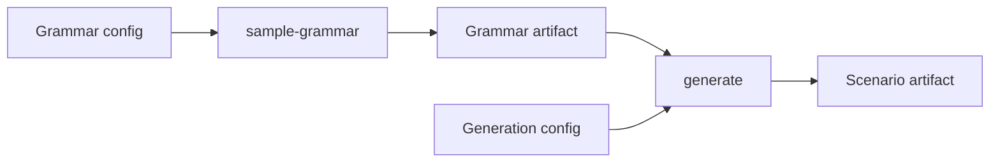
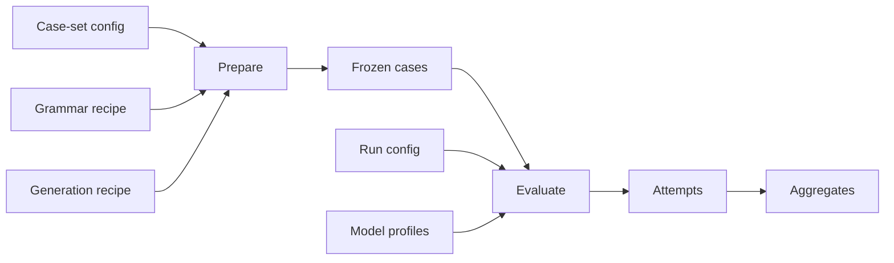

# Frabble Workflow Guide

Frabble has two related workflows. The standalone workflow produces one grammar and one generated board for exploration. The evaluation workflow prepares a reproducible collection of cases and later sends those unchanged cases to one or more configured models.

Both workflows use the same language, board, generator, and validation concepts. Their difference is the artifact boundary: standalone generation is convenient for inspection, while prepared evaluation cases are designed for fair comparison and long-term reproducibility.

## Setup

Frabble requires Python 3.11 or newer and [`uv`](https://docs.astral.sh/uv/).

```bash
uv sync
```

Grammar sampling, board generation, case preparation, tests, and inspection of stored artifacts run locally. Provider credentials are only needed when a model is called. The expected environment variables are shown in [`.env.example`](../.env.example), and model profiles map those variables to provider backends in [`config/model_configs.yaml`](../config/model_configs.yaml).

## Standalone exploration



A grammar config describes the family from which one concrete artificial language is sampled. The resulting artifact contains the alphabet, forbidden local patterns, minimum word length, symbol scores, and sampling provenance.

```bash
uv run sample-grammar --config evaluation_base_grammar
uv run analyze-grammar evaluation_base_grammar --max-length 10
```

The analysis command reports how many accepted sequences exist at different lengths and how quickly the language grows. This makes it possible to inspect whether a sampled language is large enough for board generation before involving the generator.

A generation config combines a saved grammar with board dimensionality and search preferences. The generator places an initial word and then adds known-valid witness moves until the requested scenario is complete.

```bash
uv run generate --config evaluation_base_sanity_check
```

The default standalone artifacts appear under `outputs/grammars/` and `outputs/scenarios/`. Their path rules are defined alongside the corresponding config models in [`src/formal/grammar/config.py`](../src/formal/grammar/config.py) and [`src/generator/config.py`](../src/generator/config.py).

[`visualization/inspect_scenario.ipynb`](../visualization/inspect_scenario.ipynb) reconstructs the witness history and shows how the board changes from one transition to the next.

## Prepared evaluation



Preparation expands a case-set config into independent board-size and sampling-round combinations. Each combination receives deterministically derived seeds, its own sampled grammar, a generated scenario, and a frozen evaluation case. A board size describes how many placed word segments are visible to the model; size zero is the empty-board boundary case.

```bash
uv run prepare --config 1r_sanity_check
```

An evaluation case embeds the exact board, rack, grammar, hidden witness, resolved parameters, hashes, and provenance required to reproduce the question. Evaluation therefore does not depend on whatever the YAML recipes or grammar files contain later.

A run config selects model profiles and prepared board sizes. Each case/model pair becomes an independent job. Completed attempts are persisted as they finish, so an interrupted run can continue without resending final jobs.

```bash
uv run evaluate --config or_1r_sanity_check
```

`evaluate` sends real provider requests and may incur cost. The selected run config in [`config/evaluation/runs/`](../config/evaluation/runs/) and the referenced profiles in [`config/model_configs.yaml`](../config/model_configs.yaml) determine which calls are made.

Evaluation artifacts live under `outputs/evaluation/<case-set>/`. Prepared grammars, scenarios, cases, and schemas sit at the case-set level. Model attempts and their summaries are grouped below a run ID. [Evaluation Artifacts and Lifecycle](evaluation/artifacts.md) explains how those files relate.

## What the model solves

The model sees a sparse board, a rack, symbol scores, and a complete description of the sampled language. It returns one JSON move containing a start coordinate, an axis, and the full symbol sequence across the proposed slot.

The hidden witness proves that the case has at least one solution, but it is not the only accepted answer and need not be the highest-scoring move. The submitted move is parsed and checked independently for language membership, spatial consistency, overlap, word extension, cross-words, and rack usage.

The conceptual boundaries are described in [Domain and Representations](foundations/domain-and-representations.md) and [Move Validation](foundations/move-validation.md). Their implementation lives in [`src/llm/prompting.py`](../src/llm/prompting.py), [`src/llm/representers.py`](../src/llm/representers.py), [`src/formal/parsing.py`](../src/formal/parsing.py), and [`src/formal/validation.py`](../src/formal/validation.py).

## Inspecting results

- [`visualization/inspect_llm_run.ipynb`](../visualization/inspect_llm_run.ipynb) is the interactive path for understanding one prompt and response.
- [`visualization/inspect_evaluation.ipynb`](../visualization/inspect_evaluation.ipynb) summarizes a complete stored run.
- [`visualization/inspect_evaluation_attempt.ipynb`](../visualization/inspect_evaluation_attempt.ipynb) shows the prompt, response, validation result, and board for one attempt.

The test suite exercises the same boundaries without making provider calls:

```bash
uv run python -m unittest discover -s tests -q
```

The [documentation map](README.md) provides the next level of orientation through the language, generator, validation, and evaluation subsystems.
